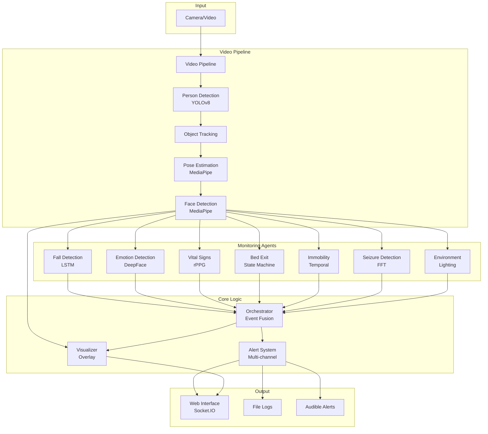
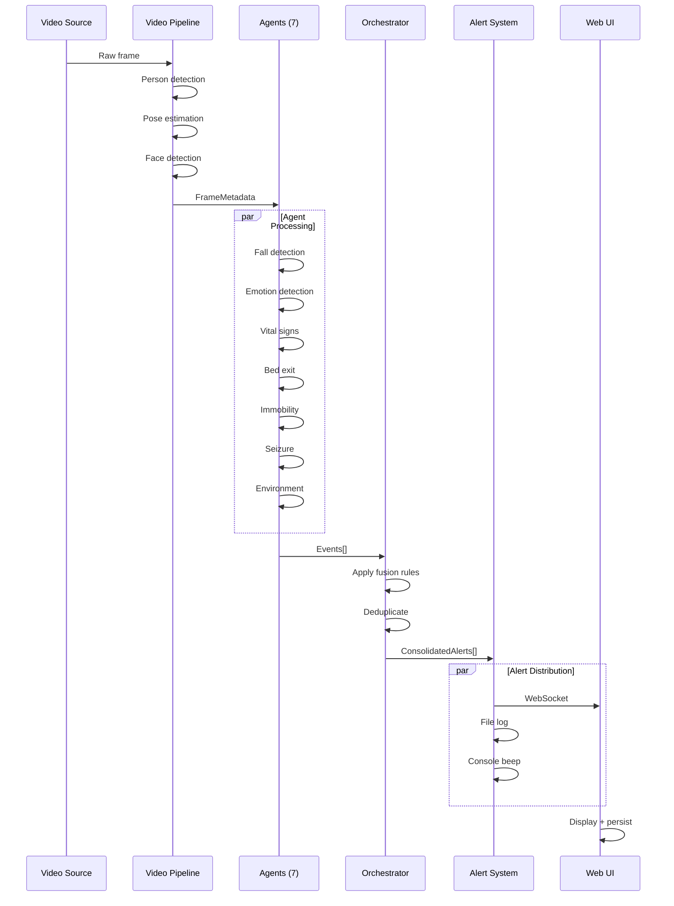

# Multi-Agent Elderly Patient Monitoring System
## Complete Technical Documentation

---

## Table of Contents
1. [Getting Started](#getting-started)
2. [System Overview](#system-overview)
3. [Architecture](#architecture)
4. [Core Components](#core-components)
5. [Monitoring Agents](#monitoring-agents)
5. [Data Flow](#data-flow)
6. [Configuration](#configuration)
7. [API Reference](#api-reference)
8. [Deployment](#deployment)

---

## Getting Started

### Prerequisites
- **Python**: 3.8 or higher
- **Operating System**: macOS, Linux, or Windows
- **RAM**: 4GB minimum (8GB recommended)
- **Camera**: USB webcam or built-in camera (optional, can use video files)

### Installation

#### Step 1: Clone or Download the Project
```bash
cd /path/to/your/projects
# If you have the project, navigate to it
cd patient_monitoring_system
```

#### Step 2: Install Dependencies
```bash
# Install all required packages
pip install -r requirements.txt
```

**Key packages installed:**
- `opencv-python` - Computer vision
- `mediapipe` - Pose and face detection
- `ultralytics` - YOLOv8 person detection
- `deepface` - Emotion recognition
- `flask`, `flask-socketio` - Web server
- `scipy`, `numpy` - Scientific computing

#### Step 3: Verify Installation
```bash
# Check if camera is accessible
python check_cameras.py
```

### Running the System

You have **two options** to run the system:

---

#### Option 1: Web Interface (Recommended)

**Start the web server:**
```bash
python web_server.py
```

**Expected output:**
```
================================================================================
Patient Monitoring System - Web Server
================================================================================

Starting server at http://localhost:5001
Press Ctrl+C to stop

 * Running on http://127.0.0.1:5001
```

**Access the interface:**
1. Open your web browser
2. Navigate to: **http://localhost:5001**
3. You'll see the monitoring dashboard

**Using the web interface:**

1. **Select Input Source:**
   - Choose "Webcam (0)" for live camera
   - Choose "Upload Video" to test with a video file

2. **Upload a Video (Optional):**
   - Click "Choose File"
   - Select a video file (MP4, AVI, MOV)
   - Click "Upload"
   - Wait for confirmation

3. **Start Monitoring:**
   - Click "▶ Start Monitoring"
   - Video feed will appear in the center
   - Alerts will show on the right panel
   - Vital signs display at the top right

4. **Stop Monitoring:**
   - Click "⏹ Stop" when done

---

#### Option 2: Command Line Interface

**Run with webcam:**
```bash
python main.py --input 0 --visualize
```

**Run with video file:**
```bash
python main.py --input path/to/video.mp4 --visualize
```

**Save output video:**
```bash
python main.py --input video.mp4 --visualize --output result.mp4
```

**Run without visualization (headless):**
```bash
python main.py --input video.mp4 --output result.mp4
```

**Command options:**
- `--input` : Video source (0 for webcam, or file path)
- `--visualize` : Show real-time window with overlays
- `--output` : Save processed video to file

**Keyboard controls (when visualizing):**
- Press `q` to quit

---

### Quick Test

**Test with a sample video:**
```bash
# The project includes test videos in test_videos/
python main.py --input test_videos/fall-01-cam1.mp4 --visualize
```

**Expected behavior:**
- Video window opens showing the person
- Bounding boxes around detected people
- Skeleton overlay on the person
- Alerts appear when events are detected
- Console shows colored alert messages
- Beep sounds for CRITICAL/HIGH alerts

---

### Troubleshooting

**"Address already in use" (Web server):**
```bash
# Kill existing process on port 5001
lsof -ti:5001 | xargs kill -9

# Then restart
python web_server.py
```

**"Camera not found":**
- Check if camera is connected
- Try different camera index: `--input 1` or `--input 2`
- Use a video file instead: `--input video.mp4`

**Slow performance / Low FPS:**
- Reduce resolution in `config.py`:
  ```python
  VIDEO_CONFIG = {
      "frame_width": 640,  # Lower from 1280
      "frame_height": 480,  # Lower from 720
  }
  ```
- Close other applications
- Use GPU if available (requires CUDA setup)

**No alerts appearing:**
- Check that events are being detected (look at console output)
- Verify thresholds in `config.py` aren't too strict
- Ensure good lighting for face/emotion detection
- Make sure person is clearly visible in frame

---

### Test Videos Recommended

For comprehensive testing, download videos with these scenarios:

1. **Fall Detection**: "elderly person falling"
2. **Emotion Detection**: "elderly person sad/distressed"
3. **Bed Exit**: "person getting out of bed"
4. **Low Lighting**: "bedroom night vision"
5. **Seizure**: "seizure simulation medical"

**Video sources:**
- Pexels: https://www.pexels.com/search/videos/elderly/
- Pixabay: https://pixabay.com/videos/search/elderly/

---

## System Overview

### Purpose
Real-time AI-powered monitoring system for elderly care, detecting falls, emotions, vital signs, bed exits, immobility, seizures, and environmental hazards.

### Key Features
- **7 Specialized AI Agents** for comprehensive monitoring
- **Real-time Web Interface** with WebSocket streaming
- **Multi-level Alert System** (INFO → CRITICAL)
- **Persistent Alert History** with acknowledgment
- **Audible Alarms** for critical events
- **Low-light Detection** for fall risk prevention
- **Empty Bed Tracking** for bathroom safety

### Technology Stack
- **Computer Vision**: OpenCV, MediaPipe, YOLOv8
- **Deep Learning**: PyTorch, DeepFace
- **Backend**: Python, Flask, Socket.IO
- **Frontend**: HTML5, JavaScript, WebSocket

---

## Architecture

### System Architecture Diagram



### Module Hierarchy

```
patient_monitoring_system/
├── core/                    # Core system components
│   ├── video_pipeline.py   # Video processing & perception
│   ├── orchestrator.py     # Event fusion & rules
│   ├── alert_system.py     # Multi-channel alerts
│   ├── visualizer.py       # Frame annotation
│   └── base_agent.py       # Agent base class
├── agents/                  # Specialized monitoring agents
│   ├── fall_detection_agent.py
│   ├── emotion_detection_agent.py
│   ├── vital_signs_agent.py
│   ├── bed_exit_agent.py
│   ├── immobility_agent.py
│   ├── seizure_detection_agent.py
│   └── environment_agent.py
├── perception/              # Low-level CV modules
│   ├── person_detector.py
│   ├── pose_estimator.py
│   └── face_detector.py
├── utils/                   # Utilities
│   ├── geometry.py
│   └── temporal_buffer.py
├── config.py               # System configuration
├── schemas.py              # Data structures
├── main.py                 # CLI application
└── web_server.py           # Web interface
```

---

## Core Components

### 1. Video Pipeline
**File**: `core/video_pipeline.py`

**Responsibilities:**
- Video capture (webcam/file)
- Person detection (YOLOv8)
- Multi-object tracking
- Pose estimation (MediaPipe 33 keypoints)
- Face detection (MediaPipe)

**Key Methods:**
- `initialize()` - Setup perception models
- `start()` - Begin video capture
- `read_frame()` - Process next frame
- `stop()` - Cleanup resources

**Output**: `FrameMetadata` with detections, poses, faces

---

### 2. Orchestrator
**File**: `core/orchestrator.py`

**Responsibilities:**
- Collect events from all agents
- Apply fusion rules (e.g., fall + low HR = critical)
- Deduplicate alerts (5-second window)
- Prioritize by severity

**Alert Levels:**
- `INFO` - Informational (vital signs)
- `LOW` - Minor concern
- `MEDIUM` - Moderate risk (bed exit, low light)
- `HIGH` - Serious concern (fear, extended absence)
- `CRITICAL` - Emergency (fall, seizure, empty bed 1hr+)

**Fusion Rules:**
```python
"fall_detected_immediate": {
    "conditions": ["fall_detected"],
    "level": "CRITICAL",
    "message": "CRITICAL: Fall detected!"
}
```

---

### 3. Alert System
**File**: `core/alert_system.py`

**Channels:**
- **Console**: Colored output + beep for CRITICAL/HIGH
- **File**: Timestamped logs (`logs/alerts.log`)
- **Webhook**: HTTP POST (configurable)
- **Email**: SMTP notifications (configurable)

**Beep Character**: `\a` (ASCII bell) for audible alerts

---

### 4. Visualizer
**File**: `core/visualizer.py`

**Overlays:**
- Bounding boxes (person detection)
- Skeleton (pose keypoints)
- Face rectangles
- Alert banners (color-coded by severity)
- Vital signs display
- FPS counter

---

## Monitoring Agents

### 1. Fall Detection Agent
**File**: `agents/fall_detection_agent.py`

**Method**: LSTM neural network on pose sequences

**Detects:**
- Standing → ground falls
- Sitting → floor falls
- Near-falls (stumbles)
- Abnormal collapses

**Metrics:**
- Torso angle (>60° = fall risk)
- Hip height (<0.3 normalized = on ground)
- Vertical velocity

**Alert**: CRITICAL

---

### 2. Emotion Detection Agent
**File**: `agents/emotion_detection_agent.py`

**Method**: DeepFace CNN on facial expressions

**Detects (Critical Only):**
- **Sad** - Distress, depression
- **Fear** - Anxiety, confusion
- **Angry** - Agitation, frustration

**Filters Out**: Happy, neutral, surprise, disgust

**Alert**: HIGH (all critical emotions)

---

### 3. Vital Signs Agent
**File**: `agents/vital_signs_agent.py`

**Method**: rPPG (remote photoplethysmography) - CHROM algorithm

**Measures:**
- **Heart Rate** (40-180 bpm)
- **Respiratory Rate** (8-30 breaths/min)
- **Signal Quality** (0-1 confidence)

**Requirements:**
- Clear face view
- Good lighting
- Minimal movement
- 10+ second window

**Alert**: INFO (continuous monitoring)

---

### 4. Bed Exit Agent
**File**: `agents/bed_exit_agent.py`

**Method**: State machine + IoU tracking

**States:**
1. `IN_BED` - Lying down
2. `SITTING_UP` - Torso upright
3. `STANDING` - Vertical posture
4. `OUT_OF_BED` - Outside bed region

**Enhanced Features:**
- **Empty Bed Detection**
  - WARNING after 30 minutes
  - CRITICAL after 1 hour
- **Bathroom Visit Tracking**
  - HIGH alert after 15 minutes away

**Auto-calibration**: First 30 frames define bed region

**Alert**: MEDIUM (state changes), HIGH/CRITICAL (extended absence)

---

### 5. Immobility Agent
**File**: `agents/immobility_agent.py`

**Method**: Temporal movement analysis

**Detects:**
- No movement for 2+ hours
- No posture changes
- Pressure ulcer risk

**Thresholds:**
- Movement: <0.05 normalized magnitude
- Posture change: <15° rotation
- Bed-specific: 2 hours

**Alert**: MEDIUM

---

### 6. Seizure Detection Agent
**File**: `agents/seizure_detection_agent.py`

**Method**: FFT (Fast Fourier Transform) on limb trajectories

**Detects:**
- High-frequency repetitive movements (3-10 Hz)
- Multiple limbs affected (2+ limbs)
- Sustained pattern (5+ seconds)

**Limbs Analyzed:**
- Left/right arms (shoulder → elbow → wrist)
- Left/right legs (hip → knee → ankle)

**Alert**: CRITICAL

---

### 7. Environment Agent
**File**: `agents/environment_agent.py`

**Method**: Frame brightness analysis

**Detects:**
- Low lighting (<50/255 brightness)
- Fall risk in darkness

**Risk Levels:**
- HIGH: <20 brightness (very dark)
- MEDIUM: 20-35 (dim)
- LOW: 35-50 (slightly dark)

**Alert**: MEDIUM

---

## Data Flow

### Frame Processing Pipeline



### Event Schema

```python
@dataclass
class BaseEvent:
    event_type: str          # "fall_detection", "emotion_detection", etc.
    timestamp: float         # Unix timestamp
    confidence: float        # 0.0-1.0
    agent_name: str         # "fall_detection", etc.
    frame_id: int           # Sequential frame number

# Specialized events inherit from BaseEvent
class FallDetectionEvent(BaseEvent):
    fall_type: str          # "fall", "near_fall", "lying"
    torso_angle: float
    hip_height: float
    ...
```

---

## Configuration

### Key Configuration Files

#### `config.py`
Central configuration for all modules:

```python
# Video settings
VIDEO_CONFIG = {
    "input_source": 0,      # 0=webcam, or path
    "frame_width": 1280,
    "frame_height": 720,
    "fps": 30,
}

# Bed exit thresholds
BED_EXIT_CONFIG = {
    "empty_bed_warning_time": 1800,   # 30 min
    "empty_bed_critical_time": 3600,  # 1 hour
    "bathroom_visit_max_time": 900,   # 15 min
}

# Environment monitoring
ENVIRONMENT_CONFIG = {
    "low_light_threshold": 50,        # 0-255
    "check_interval": 30,             # seconds
}
```

---

## API Reference

### Web Server Endpoints

#### `GET /`
Main web interface

#### `POST /api/start`
Start monitoring
```json
{
  "source": "0"  // or video path
}
```

#### `POST /api/stop`
Stop monitoring

#### `GET /api/status`
Get current status
```json
{
  "active": true,
  "source": "0"
}
```

#### `POST /api/upload`
Upload video file
```json
{
  "status": "uploaded",
  "path": "uploads/video.mp4"
}
```

### WebSocket Events

#### `frame_update`
Real-time frame + alerts
```javascript
{
  "frame": "base64_jpeg",
  "events": [{type, confidence, ...}],
  "alerts": [{level, message, timestamp}],
  "fps": 15.3
}
```

#### `monitoring_stopped`
Stream ended
```javascript
{
  "reason": "End of video"
}
```

---

## Deployment

### Running the System

#### CLI Mode (Terminal)
```bash
# Webcam
python main.py --input 0 --visualize

# Video file
python main.py --input video.mp4 --visualize --output result.mp4
```

#### Web Interface
```bash
# Start server
python web_server.py

# Access at http://localhost:5001
```

### System Requirements
- **Python**: 3.8+
- **RAM**: 4GB minimum, 8GB recommended
- **CPU**: Multi-core (GPU optional)
- **Camera**: 720p+ for vital signs

### Dependencies
```bash
pip install -r requirements.txt
```

Key packages:
- `opencv-python`
- `mediapipe`
- `ultralytics` (YOLOv8)
- `deepface`
- `flask`, `flask-socketio`
- `scipy`, `numpy`

---

## Performance Metrics

| Component | Processing Time | Notes |
|-----------|----------------|-------|
| Person Detection | ~30ms | YOLOv8n (nano) |
| Pose Estimation | ~40ms | MediaPipe |
| Face Detection | ~20ms | MediaPipe |
| Emotion Analysis | ~100ms | DeepFace (every 5 frames) |
| Vital Signs | ~50ms | rPPG (every 30 frames) |
| **Total FPS** | **10-15** | CPU-only |

**GPU Acceleration**: 25-30 FPS possible with CUDA

---

## Alert Summary Table

| Event | Level | Trigger | Beep |
|-------|-------|---------|------|
| Fall | CRITICAL | Immediate | ✅ |
| Seizure | CRITICAL | 5+ seconds | ✅ |
| Empty Bed (1hr) | CRITICAL | 60 minutes | ✅ |
| Fear Emotion | HIGH | Immediate | ✅ |
| Sad Emotion | HIGH | Immediate | ✅ |
| Angry Emotion | HIGH | Immediate | ✅ |
| Extended Absence | HIGH | 15 minutes | ✅ |
| Empty Bed (30min) | MEDIUM | 30 minutes | ❌ |
| Low Lighting | MEDIUM | Immediate | ❌ |
| Bed Exit | MEDIUM | State change | ❌ |
| Immobility | MEDIUM | 2 hours | ❌ |
| Vital Signs | INFO | Continuous | ❌ |

---

## Future Enhancements

### Recommended Improvements
1. **SMS/Email Notifications** - Critical for remote caregivers
2. **Historical Dashboard** - 24hr/7day reports
3. **Multi-camera Support** - Whole-home coverage
4. **Mobile App** - iOS/Android alerts
5. **Cloud Storage** - Video archival
6. **AI Model Fine-tuning** - Elderly-specific training
7. **Medication Reminders** - Integration with schedule
8. **Activity Tracking** - Daily movement patterns

---

## Support & Maintenance

### Logs Location
- **Alerts**: `logs/alerts.log`
- **System**: Console output

### Troubleshooting
- **Low FPS**: Reduce resolution in `config.py`
- **False Positives**: Adjust thresholds in agent configs
- **Camera Issues**: Check `check_cameras.py`
- **Port Conflict**: `lsof -ti:5001 | xargs kill -9`

---

**Documentation Version**: 1.0  
**Last Updated**: December 2, 2025  
**System Version**: Multi-Agent Patient Monitoring v2.0
